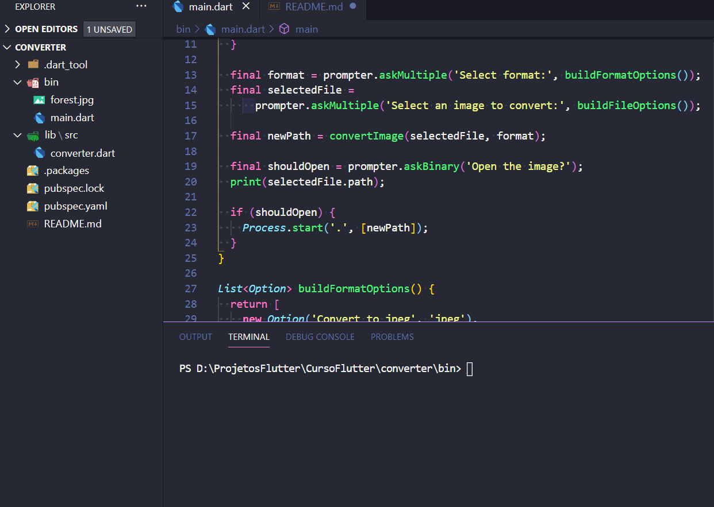

A simple prompter like program made using the dart language. The user uses command-line navigation to choose a file and convert the end extention.

To execute the pogram:
$ dart main.dart

This program uses a package previous created by me as part of the couse too, folow:
- https://pub.dev/packages/prompter_ljd

The image used to change the extension can be found here:
https://www.positive.news/environment/people-share-their-love-for-trees-and-forests-on-international-day-of-forests/
Saved into jpg and converted to png as shows in the gif.

This Flutter project was build as a part of the Dart and Flutter: The Complete Developer's Guide course.

https://www.udemy.com/certificate/UC-e1602f4f-5fbe-4d08-a36c-68a2291d935d/

